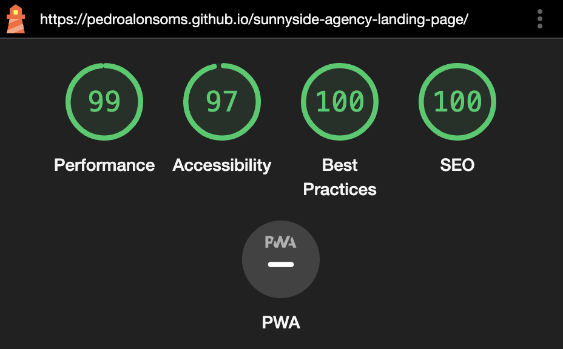

# Frontend Mentor - Sunnyside agency landing page solution

This is a solution to the [Sunnyside agency landing page challenge on Frontend Mentor](https://www.frontendmentor.io/challenges/sunnyside-agency-landing-page-7yVs3B6ef). Frontend Mentor challenges help you improve your coding skills by building realistic projects.

### Links

- [Live](https://pedroalonsoms.github.io/sunnyside-agency-landing-page/) on GitHub Pages

### Showcase

#### Desktop preview

#### Mobile ligthouse stats

### Built with

- [Astro](https://astro.build/) - Static Site Generator
- [Tailwind](https://tailwindcss.com/) - For styles

### Areas that could be improved

- Accesibility & semantics
- Extract layout into Astro components
- Add hover effects to svg's and remove their colors
- Compress assets
- Make it pixel-perfect
- Improve button's pressable area on mobile
- Disable scrolling when menu opened
- Better font default values for scalability
- Better image resizing. Avoid using `px`
- Better responsive transition and in-between states
- Avoid layout shifts when doing transitions
- Avoid using `br` tag for line breaks
- Better `4k` and large width screen support
- Fix layout shifts
- Fix `x-overflow` on really small screens
- Change text width to `max-ch` instead of weird padding hacks
- Increase vertical padding on two-column layouts
- Astro tailwind formatting on string class concatenation
- Clear up doc TODO's
- Add `max-width` on main page contents
- Avoid tailwind custom values like `tracking-[1em]`
- Also import font `400` on the other project
- Make SVG's to support a number of different colors
- Get the exact same color of `sunnyside` text on footer
- Better SVG scaling
- Better SVG accesibility
- Cross-browser testing
- Consistent SVG external imports
- Extract SVG into components
- Consistent media-queries breakpoints
- Lazy load images
- Better picture responsive width handling
- Run this stuff on lighthouse
- Run rests when zooming-in
- Add aria-controls to other project

## Acknowledgments

- Help from Web.dev: https://web.dev/
- Help from W3Schools: https://www.w3schools.com/graphics/svg_polygon.asp
- Help from MDN: https://developer.mozilla.org/en-US/
- Tons of help from StackOverflow: https://stackoverflow.com/
- Kevin Powell's YouTube Channel: https://www.youtube.com/@KevinPowell helped me a lot
- Kevin Powell's Responsive Design Article: https://www.freecodecamp.org/news/taking-the-ri:ght-approach-to-responsive-web-design/
- Adam Wathan's YouTube Channel: https://www.youtube.com/@AdamWathan
- Previous project: https://github.com/pedroalonsoms/insure-landing-page
- RGB to HSL color conversion: https://www.rapidtables.com/convert/color/rgb-to-hsl.html
- How to Scale SVG: https://css-tricks.com/scale-svg/
- SVGOMG - SVGO's Missing GUI: https://jakearchibald.github.io/svgomg/
- Stack Exchange: https://webmasters.stackexchange.com/
